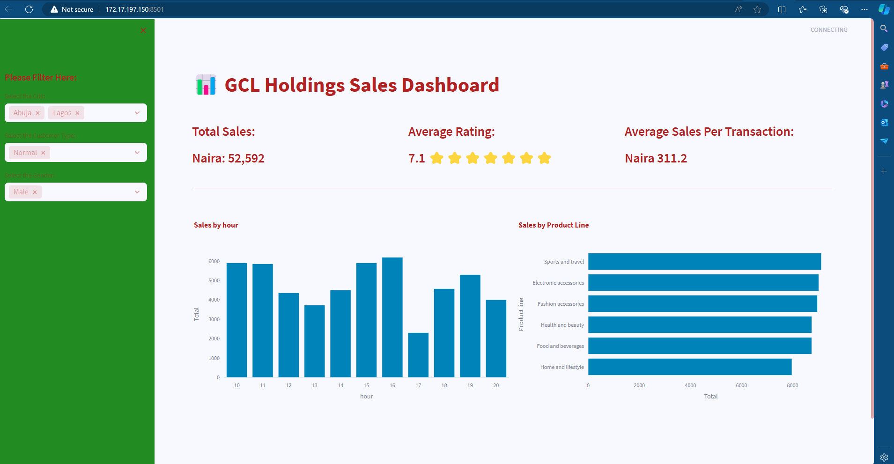

# An Interactive Dashboard with Python – Streamlit

Sales Dashboard built-in Python and Streamlit library to visualize data from Excel.

## Video Tutorial
[![YouTube Video] https://youtu.be/vyMVqvzRceM

## Run the app
```Powershell
# vanilla terminal
streamlit run app.py

# quit
ctrl-c
```

## Demo
Sales Dashboard: https://bolus321.github.io/

## Screenshot



## 🤝 Connect with Me
- 💼 **LinkedIn:** [Nnamdi Ogbolu](https://www.linkedin.com/in/tonyogbolu)


